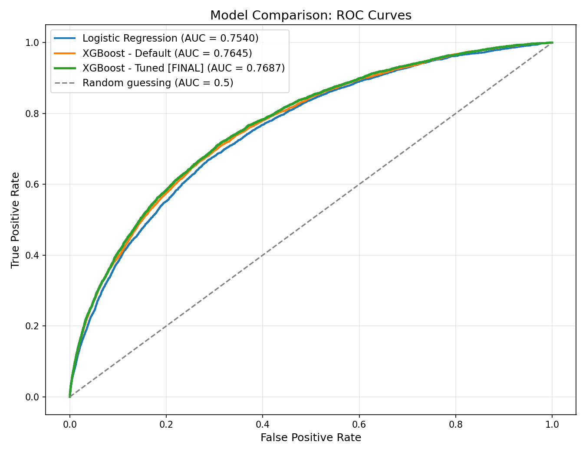

# 🏦 Credit Default Risk Prediction

An end-to-end machine learning project predicting loan default risk, with 
a live interactive dashboard and full SHAP-based explainability for every 
prediction.

**🔗 [Live Dashboard](https://github.com/jiggs108/credit-risk-dashboard)** | **📄 [Full Report](report.md)**



## Overview

Built on the Home Credit Default Risk dataset (307,511 applicants), this 
project takes a raw, messy, multi-table dataset through the full pipeline 
to a deployed, explainable model:

- **Data cleaning**: handled missing values, placeholder bugs, and 
  high-missingness columns across 122 original features
- **Feature engineering**: 14 custom features derived from applicants' 
  prior loan, payment, and credit bureau history
- **Modeling**: compared logistic regression, default XGBoost, and tuned 
  XGBoost (via RandomizedSearchCV), selected on AUC-ROC and KS-statistic
- **Explainability**: SHAP analysis at both global and individual-prediction 
  levels — every prediction the model makes can be explained, not just 
  scored
- **Deployment**: interactive Streamlit dashboard, live and publicly 
  accessible

## Results

| Model | AUC-ROC | KS-Statistic |
|---|---|---|
| Logistic Regression | 0.7540 | 0.3819 |
| XGBoost (default) | 0.7645 | 0.3959 |
| **XGBoost (tuned)** | **0.7687** | **0.4046** |

## Tech Stack

Python · pandas · scikit-learn · XGBoost · SHAP · Streamlit

## Project Structure
## Running Locally

```bash
git clone https://github.com/jiggs108/credit-risk-dashboard.git
cd credit-risk-dashboard
pip install -r requirements.txt
streamlit run app.py
```

## Full Write-Up

See [report.md](report.md) for the complete methodology, results, 
explainability analysis, and limitations discussion.